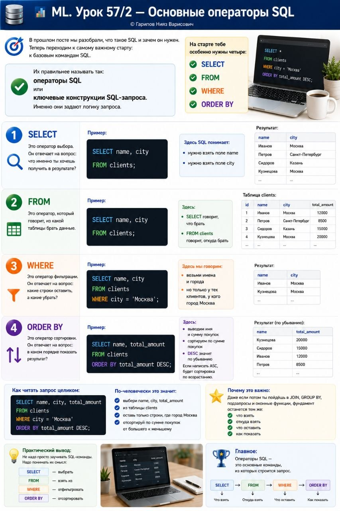

# ML. Урок 57/2 — Основные операторы SQL

**Номер:** 57/2

📊 ML. Урок 57/2 — Основные операторы SQL

В прошлом посте мы разобрали, что такое SQL и зачем он нужен.

Теперь переходим к самому важному старту:
к базовым командам SQL.

Их правильнее называть так:

операторы SQL
или
ключевые конструкции SQL-запроса.

Именно они задают логику запроса.

На старте тебе особенно нужны четыре:
• SELECT
• FROM
• WHERE
• ORDER BY

1️⃣ SELECT
Это оператор выбора.
Он отвечает на вопрос: что именно ты хочешь получить в результате?

Пример:
SELECT name, city
FROM clients;
Здесь SQL понимает:
• нужно взять поле name
• нужно взять поле city

2️⃣ FROM
Это оператор, который говорит, из какой таблицы брать данные.

Пример:
SELECT name, city
FROM clients;
Здесь:
• SELECT говорит, что брать
• FROM clients говорит, откуда брать

3️⃣ WHERE
Это оператор фильтрации.
Он отвечает на вопрос: какие строки оставить, а какие убрать?

Пример:
SELECT name, city
FROM clients
WHERE city = 'Москва';
Здесь мы говорим:
• возьми имена и города
• но только у тех клиентов, у кого город Москва

4️⃣ ORDER BY
Это оператор сортировки.
Он отвечает на вопрос: в каком порядке показать результат?

Пример:
SELECT name, total_amount
FROM clients
ORDER BY total_amount DESC;
Здесь:
• выводим имя и сумму покупок
• сортируем по сумме покупок
• DESC значит по убыванию

Если написать ASC, будет сортировка по возрастанию.

Как читать запрос целиком:

SELECT name, city, total_amount
FROM clients
WHERE city = 'Москва'
ORDER BY total_amount DESC;
По-человечески это значит:
• выбери name, city, total_amount
• из таблицы clients
• оставь только строки, где город Москва
• отсортируй по сумме покупок от большего к меньшему

Почему это важно:
Даже если потом ты пойдёшь в JOIN, GROUP BY, подзапросы и оконные функции, фундамент останется тем же:
• что взять
• откуда взять
• что оставить
• как показать

Практический вывод:
Не надо просто заучивать SQL-команды.
Надо понимать их смысл:
• SELECT — выбрать
• FROM — взять из
• WHERE — отфильтровать
• ORDER BY — отсортировать

Главное:
Операторы SQL — это основные команды, из которых строится запрос.
