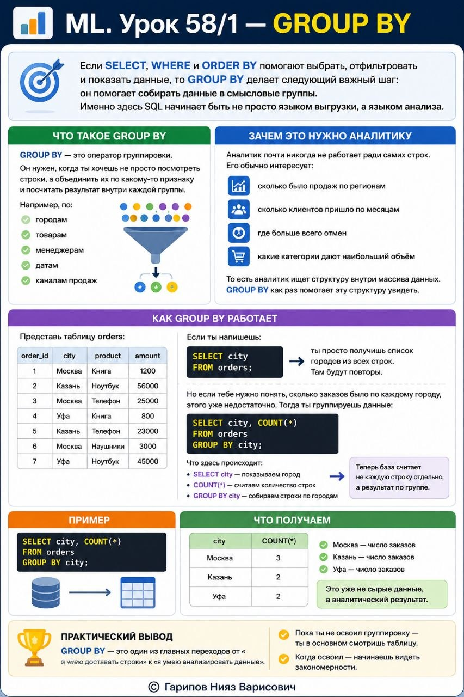

# ML. Урок 58/1 — GROUP BY

**Номер:** 58/1

📊 ML. Урок 58/1 — GROUP BY

Если SELECT, WHERE и ORDER BY помогают выбрать, отфильтровать и показать данные, то GROUP BY делает следующий важный шаг:

он помогает собирать данные в смысловые группы.

Именно здесь SQL начинает быть не просто языком выгрузки, а языком анализа.

Что такое GROUP BY

GROUP BY — это оператор группировки.

Он нужен, когда ты хочешь не просто посмотреть строки, а объединить их по какому-то признаку и посчитать результат внутри каждой группы.

Например:
• по городам
• по товарам
• по менеджерам
• по датам
• по каналам продаж

То есть вместо длинного списка отдельных заказов ты получаешь уже более умный ответ.

Не просто:
• заказ 1
• заказ 2
• заказ 3
• заказ 4

А, например:
• Москва — 120 заказов
• Казань — 85 заказов
• Уфа — 64 заказа

Вот это и есть сила группировки.

Зачем это нужно аналитику

Аналитик почти никогда не работает ради самих строк.

Его обычно интересует:
• сколько было продаж по регионам
• сколько клиентов пришло по месяцам
• где больше всего отмен
• какие категории дают наибольший объём

То есть аналитик ищет структуру внутри массива данных.

GROUP BY как раз помогает эту структуру увидеть.

Как GROUP BY работает

Представь таблицу orders:
• order_id
• city
• product
• amount

Если ты напишешь:

SELECT city
FROM orders;
ты просто получишь список городов из всех строк.
Там будут повторы.

Но если тебе нужно понять, сколько заказов было по каждому городу, этого уже недостаточно.

Тогда ты группируешь данные:

SELECT city, COUNT(*)
FROM orders
GROUP BY city;
Что здесь происходит:
• SELECT city — показываем город
• COUNT(*) — считаем количество строк
• GROUP BY city — собираем строки по городам

То есть теперь база считает не каждую строку отдельно, а результат по группе.

Пример

SELECT city, COUNT(*)
FROM orders
GROUP BY city;
Что получаем:
• Москва — число заказов
• Казань — число заказов
• Уфа — число заказов

Это уже не сырые данные, а аналитический результат.

Практический вывод

GROUP BY — это один из главных переходов от «я умею доставать строки» к «я умею анализировать данные».

Пока ты не освоил группировку, ты в основном смотришь таблицу.
Когда освоил — начинаешь видеть закономерности.
