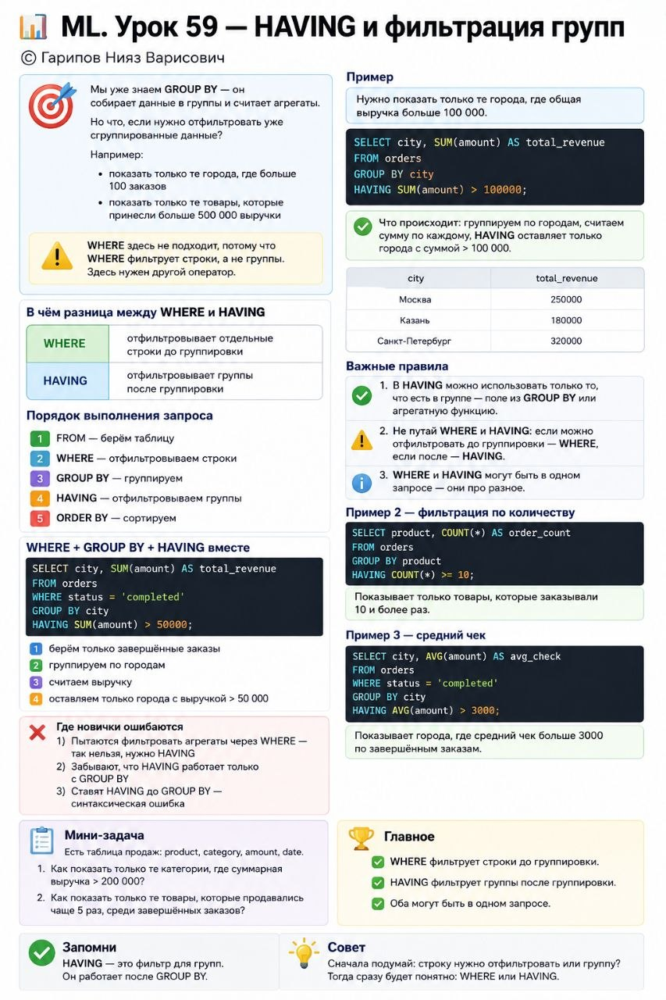

# ML. Урок 59 — HAVING и фильтрация групп

**Номер:** 59

📊 ML. Урок 59 — HAVING и фильтрация групп

Мы уже знаем GROUP BY — он собирает данные в группы и считает агрегаты.

Но что, если нужно отфильтровать уже сгруппированные данные?

Например:
• показать только те города, где больше 100 заказов
• показать только те товары, которые принесли больше 500 000 выручки

WHERE здесь не подходит, потому что WHERE фильтрует строки, а не группы.

Здесь нужен другой оператор.

В чём разница между WHERE и HAVING

• WHERE — отфильтровывает отдельные строки до группировки
• HAVING — отфильтровывает группы после группировки

Порядок выполнения:
1. FROM — берём таблицу
2. WHERE — отфильтровываем строки
3. GROUP BY — группируем
4. HAVING — отфильтровываем группы
5. ORDER BY — сортируем

Пример

Нужно показать только те города, где общая выручка больше 100 000.

SELECT city, SUM(amount) AS total_revenue
FROM orders
GROUP BY city
HAVING SUM(amount) > 100000;
Что происходит: группируем по городам, считаем сумму по каждому, HAVING оставляет только города с суммой > 100 000.

WHERE + GROUP BY + HAVING вместе

SELECT city, SUM(amount) AS total_revenue
FROM orders
WHERE status = 'completed'
GROUP BY city
HAVING SUM(amount) > 50000;
1. берём только завершённые заказы
2. группируем по городам
3. считаем выручку
4. оставляем только города с выручкой > 50 000

Важные правила

1. В HAVING можно использовать только то, что есть в группе — поле из GROUP BY или агрегатную функцию.

2. Не путай WHERE и HAVING: если можно отфильтровать до группировки — WHERE, если после — HAVING.

3. WHERE и HAVING могут быть в одном запросе — они про разное.

Пример 2 — фильтрация по количеству

SELECT product, COUNT(*) AS order_count
FROM orders
GROUP BY product
HAVING COUNT(*) >= 10;
Показывает только товары, которые заказывали 10 и более раз.

Пример 3 — средний чек

SELECT city, AVG(amount) AS avg_check
FROM orders
WHERE status = 'completed'
GROUP BY city
HAVING AVG(amount) > 3000;
Где новички ошибаются

1) Пытаются фильтровать агрегаты через WHERE — так нельзя, нужно HAVING
2) Забывают, что HAVING работает только с GROUP BY
3) Ставят HAVING до GROUP BY — синтаксическая ошибка

Мини-задача

Есть таблица продаж: product, category, amount, date.

Как показать только те категории, где суммарная выручка > 200 000?
Как показать только те товары, которые продавались чаще 5 раз, среди завершённых заказов?

Главное

WHERE фильтрует строки до группировки.
HAVING фильтрует группы после группировки.
Оба могут быть в одном запросе.
