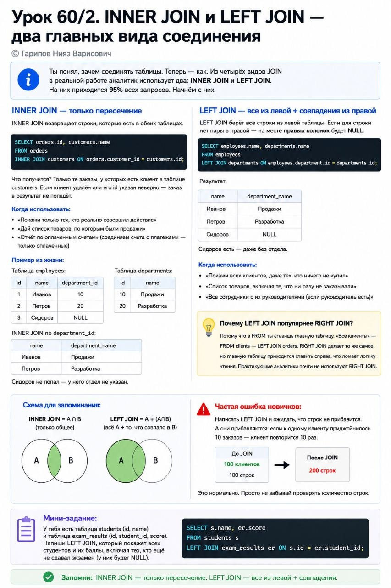

# Урок 60/1. JOIN — зачем вообще соединять таблицы

**Номер:** 60/1

**Урок 60/1. JOIN — зачем вообще соединять таблицы**

До сих пор мы работали с одной таблицей. SELECT из одной таблицы. WHERE — фильтр по одной таблице. GROUP BY — группировка внутри одной таблицы. В учебниках это выглядит красиво и аккуратно.

В жизни так не бывает.

**Почему данные не лежат в одной таблице?**

Представь интернет-магазин. Можно сделать одну гигантскую таблицу:

order_id | date | customer_name | customer_phone | customer_city | product_name | product_price | quantity | total

Выглядит просто? А теперь представь, что у одного клиента 50 заказов, и в каждом — по 3 товара. Имя клиента и его телефон будут повторяться 150 раз. А если клиент поменял телефон? Теперь надо обновить 150 строк. Забыл обновить одну — и в данных разнос.

Поэтому базы данных устроены иначе: **нормализация**. Каждая сущность хранится в своей таблице, а связываются они через ключи.

**Как это выглядит в реальном бизнесе:**

— Таблица `customers`: id, имя, телефон, город
— Таблица `orders`: id, customer_id, дата, сумма
— Таблица `products`: id, название, цена
— Таблица `order_items`: id, order_id, product_id, количество

Чтобы понять, какие товары купил Иванов из Москвы, нужно соединить все четыре таблицы. JOIN — это инструмент, который это делает.

**Главная идея урока:**

JOIN не усложняет запросы. JOIN делает их возможными. Без JOIN ты можешь анализировать только одну таблицу. С JOIN ты видишь всю картину.

**Ключевые слова, которые надо запомнить:**

— **Ключ (key)** — столбец, по которому таблицы связываются. Обычно это id. Например, customers.id = orders.customer_id
— **Левая таблица** — та, которую ты пишешь в FROM
— **Правая таблица** — та, которую ты пишешь в JOIN

**Простая аналогия:**

У тебя две папки. В одной — список учеников (имя, класс). В другой — их оценки (ученик, предмет, балл). Чтобы ответить на вопрос «какие оценки у Петрова?», ты берёшь список из первой папки, находишь Петрова, смотришь его номер (или «ключ»), идёшь во вторую папку, ищешь все строки с этим номером — вот это и есть JOIN.

**Практическая метафора для аналитика:**

JOIN — это умение найти общий ID в двух датасетах и свести их в один. В Excel ты бы делал это через ВПР. В SQL для этого есть JOIN. Только JOIN быстрее, чище и не врёт, когда нет совпадения.

**Мини-задание на понимание:**

Посмотри на любую задачу по работе: какие сущности в ней участвуют? Клиенты? Заказы? Сотрудники? Документы? Выпиши их в таблицы, придумай, по какому ключу они связаны. Это и есть проектирование JOIN.
