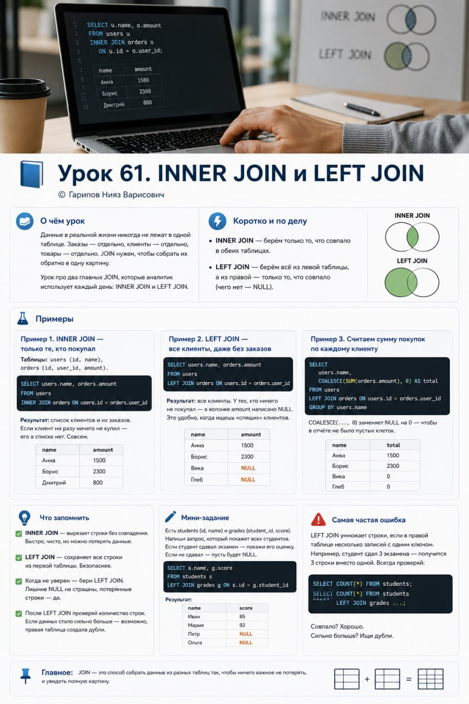

# Урок 61. INNER JOIN и LEFT JOIN

**Номер:** 61

📘 Урок 61. INNER JOIN и LEFT JOIN

О чём урок

Данные в реальной жизни никогда не лежат в одной таблице. Заказы — отдельно, клиенты — отдельно, товары — отдельно. JOIN нужен, чтобы собрать их обратно в одну картину.

Урок про два главных JOIN, которые аналитик использует каждый день: INNER JOIN и LEFT JOIN.

Коротко и по делу

INNER JOIN — берём только то, что совпало в обеих таблицах.
LEFT JOIN — берём всё из левой таблицы, а из правой — только то, что совпало (чего нет — NULL).

Примеры

*Пример 1. INNER JOIN — только те, кто покупал*

Таблицы: users (id, name), orders (id, user_id, amount).

SELECT users.name, orders.amount
FROM users
INNER JOIN orders ON users.id = orders.user_id

Результат: список клиентов и их заказов. Если клиент ни разу ничего не купил — его в списке нет. Совсем.

*Пример 2. LEFT JOIN — все клиенты, даже без заказов*

SELECT users.name, orders.amount
FROM users
LEFT JOIN orders ON users.id = orders.user_id

Результат: все клиенты. У тех, кто ничего не покупал — в колонке amount написано NULL. Это удобно, когда ищешь «спящих» клиентов.

*Пример 3. Считаем сумму покупок по каждому клиенту*

SELECT
    users.name,
    COALESCE(SUM(orders.amount), 0) AS total
FROM users
LEFT JOIN orders ON users.id = orders.user_id
GROUP BY users.name

COALESCE(..., 0) заменяет NULL на 0 — чтобы в отчёте не было пустых клеток.

Что запомнить

- INNER JOIN — вырезает строки без совпадения. Быстро, чисто, но можно потерять данные.
- LEFT JOIN — сохраняет все строки из первой таблицы. Безопаснее.
- Когда не уверен — бери LEFT JOIN. Лишние NULL не страшны, потерянные строки — да.
- После LEFT JOIN проверяй количество строк. Если данных стало сильно больше — возможно, правая таблица создала дубли.

Мини-задание

Есть students (id, name) и grades (student_id, score). Напиши запрос, который покажет всех студентов. Если студент сдавал экзамен — покажи его оценку. Если не сдавал — пусть будет NULL.

Самая частая ошибка

LEFT JOIN умножает строки, если в правой таблице несколько записей с одним ключом. Например, студент сдал 3 экзамена — получится 3 строки вместо одной. Всегда проверяй:

SELECT COUNT(*) FROM students;
SELECT COUNT(*) FROM students LEFT JOIN grades ...;

Совпало? Хорошо. Сильно больше? Ищи дубли.
