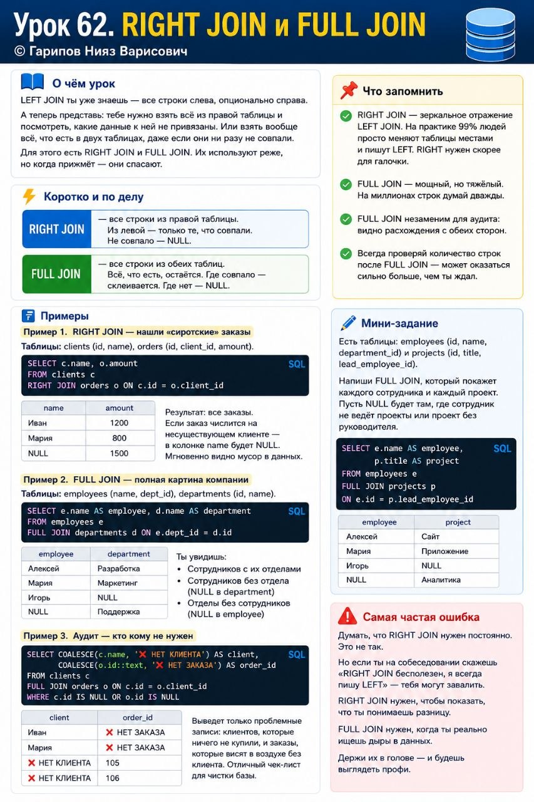

# Урок 62. RIGHT JOIN и FULL JOIN

**Номер:** 62

📘 Урок 62. RIGHT JOIN и FULL JOIN

О чём урок

LEFT JOIN ты уже знаешь — все строки слева, опционально справа.

А теперь представь: тебе нужно взять *всё из правой* таблицы и посмотреть, какие данные к ней не привязаны. Или взять *вообще всё, что есть в двух таблицах*, даже если они ни разу не совпали.

Для этого есть RIGHT JOIN и FULL JOIN. Их используют реже, но когда прижмёт — они спасают.

Коротко и по делу

RIGHT JOIN — все строки из правой таблицы. Из левой — только те, что совпали. Не совпало — NULL.

FULL JOIN — все строки из обеих таблиц. Всё, что есть, остаётся. Где совпало — склеивается. Где нет — NULL.

Примеры

*Пример 1. RIGHT JOIN — нашли «сиротские» заказы*

Таблицы: clients (id, name), orders (id, client_id, amount).

SELECT c.name, o.amount
FROM clients c
RIGHT JOIN orders o ON c.id = o.client_id
Результат: все заказы. Если заказ числится на несуществующем клиенте — в колонке name будет NULL. Мгновенно видно мусор в данных.

*Пример 2. FULL JOIN — полная картина компании*

Таблицы: employees (name, dept_id), departments (id, name).

SELECT e.name AS employee, d.name AS department
FROM employees e
FULL JOIN departments d ON e.dept_id = d.id
Ты увидишь:
- Сотрудников с их отделами
- Сотрудников без отдела (NULL в department)
- Отделы без сотрудников (NULL в employee)

Одним запросом — вся структура и все дыры.

*Пример 3. Аудит — кто кому не нужен*

SELECT COALESCE(c.name, '❌ НЕТ КЛИЕНТА') AS client,
       COALESCE(o.id::text, '❌ НЕТ ЗАКАЗА') AS order_id
FROM clients c
FULL JOIN orders o ON c.id = o.client_id
WHERE c.id IS NULL OR o.id IS NULL
Выведет только проблемные записи: клиентов, которые ничего не купили, и заказы, которые висят в воздухе без клиента. Отличный чек-лист для чистки базы.

Что запомнить

- RIGHT JOIN — зеркальное отражение LEFT JOIN. На практике 99% людей просто меняют таблицы местами и пишут LEFT. RIGHT нужен скорее для галочки.
- FULL JOIN — мощный, но тяжёлый. На миллионах строк думай дважды.
- FULL JOIN незаменим для аудита: видно расхождения с обеих сторон.
- Всегда проверяй количество строк после FULL JOIN — может оказаться сильно больше, чем ты ждал.

Мини-задание

Есть таблицы: employees (id, name, department_id) и projects (id, title, lead_employee_id). Напиши FULL JOIN, который покажет каждого сотрудника и каждый проект. Пусть NULL будет там, где сотрудник не ведёт проекты или проект без руководителя.

Самая частая ошибка

Думать, что RIGHT JOIN нужен постоянно. Это не так. Но если ты на собеседовании скажешь «RIGHT JOIN бесполезен, я всегда пишу LEFT» — тебя могут завалить. RIGHT JOIN нужен, чтобы показать, что ты понимаешь разницу. FULL JOIN нужен, когда ты реально ищешь дыры в данных. Держи их в голове — и будешь выглядеть профи.
