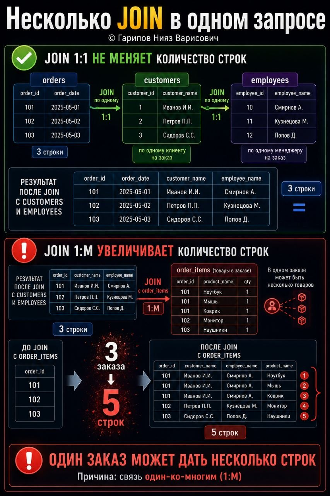

# ML и анализ данных • Урок 63

**Номер:** 63

ML и анализ данных • Урок 63
Несколько JOIN в одном запросе

Один JOIN — это легко.
Два JOIN — уже повнимательнее.
А когда таблиц три, четыре и больше, SQL начинает очень быстро показывать, насколько хорошо вы понимаете структуру данных.

Допустим, у нас есть:

• orders — заказы
• customers — клиенты
• employees — менеджеры

И мы хотим получить по каждому заказу:

• номер заказа
• дату заказа
• имя клиента
• имя менеджера

SELECT
    o.order_id,
    o.order_date,
    c.customer_name,
    e.employee_name AS manager_name
FROM orders o
JOIN customers c
    ON o.customer_id = c.customer_id
JOIN employees e
    ON o.employee_id = e.employee_id;
Что здесь происходит:

• из orders берём заказ
• по customer_id присоединяем клиента
• по employee_id присоединяем менеджера

Так работает запрос с несколькими JOIN:
есть главная таблица, и к ней по очереди подтягиваются остальные.

Почему это важно?
Потому что в реальной аналитике почти никогда не хватает одной таблицы. Обычно данные разложены отдельно:

• заказы
• клиенты
• товары
• сотрудники
• статусы
• категории

И задача аналитика, собрать их в один понятный результат.

Но здесь есть важный нюанс.
Если вы делаете JOIN с таблицей, где одной записи соответствует несколько строк, итоговый результат начинает разрастаться.

Например:

SELECT *
FROM orders o
JOIN customers c ON o.customer_id = c.customer_id
JOIN order_items oi ON o.order_id = oi.order_id;
Если в одном заказе 5 товаров, вы получите 5 строк по этому заказу.
Это не ошибка SQL. Это нормальный результат связи один-ко-многим.

Чтобы не путаться в нескольких JOIN, держите 3 правила:

1. Определяйте главную таблицу
Сначала решите, про что строится запрос.
Если про заказы, значит главная таблица orders.

2. Присоединяйте таблицы по одной
Сделали один JOIN, проверили результат, потом добавили следующий.

3. Следите за кратностью связей
Именно она определяет, почему строк стало больше или меньше, чем вы ожидали.

Вывод:
Несколько JOIN — это обычная рабочая ситуация в аналитике.
Главное, не просто написать запрос, а понимать, как связаны таблицы и почему результат выглядит именно так.
