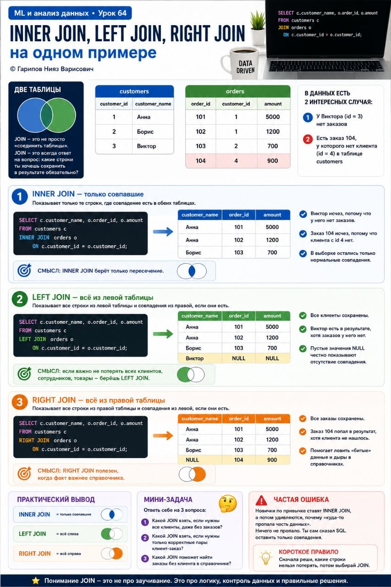

# ML и анализ данных • Урок 64

**Номер:** 64

ML и анализ данных • Урок 64
INNER JOIN, LEFT JOIN, RIGHT JOIN на одном примере

Если ты путаешься в JOIN, ты не один. У новичков это одна из самых частых точек боли в SQL. Всё потому, что названия похожи, а результат у запросов разный.

Разберём это на одном живом примере, без академического тумана.

Простое объяснение
Представь две таблицы:

customers

• customer_id
• customer_name

orders

• order_id
• customer_id
• amount

Данные:

customers

• 1, Анна
• 2, Борис
• 3, Виктор

orders

• 101, 1, 5000
• 102, 1, 1200
• 103, 2, 700
• 104, 4, 900

Здесь специально есть 2 интересных случая:

• у Виктора нет заказов
• есть заказ 104, у которого нет клиента в таблице customers

Вот на этом и видно, как думает каждый JOIN.

Ключевая идея
JOIN, это не просто «соединить таблицы».
JOIN, это всегда ответ на вопрос:
какие строки ты хочешь сохранить в результате обязательно?

1. INNER JOIN

Показывает только те строки, где совпадение есть в обеих таблицах.

SELECT c.customer_name, o.order_id, o.amount
FROM customers c
INNER JOIN orders o
    ON c.customer_id = o.customer_id;
Результат:

• Анна, 101, 5000
• Анна, 102, 1200
• Борис, 103, 700

Пример 1: Виктор исчез, потому что у него нет заказов.
Пример 2: заказ 104 исчез, потому что клиента с id 4 нет.
Пример 3: в выборке остались только нормальные совпадения.

Смысл: INNER JOIN берёт только пересечение.

2. LEFT JOIN

Показывает все строки из левой таблицы и совпадения из правой, если они есть.

SELECT c.customer_name, o.order_id, o.amount
FROM customers c
LEFT JOIN orders o
    ON c.customer_id = o.customer_id;
Результат:

• Анна, 101, 5000
• Анна, 102, 1200
• Борис, 103, 700
• Виктор, NULL, NULL

Пример 1: все клиенты сохранены.
Пример 2: Виктор есть в результате, хотя заказа у него нет.
Пример 3: пустые значения NULL честно показывают отсутствие совпадения.

Смысл: если важно не потерять всех клиентов, сотрудников, товары, берёшь LEFT JOIN.

3. RIGHT JOIN

Показывает все строки из правой таблицы и совпадения из левой.

SELECT c.customer_name, o.order_id, o.amount
FROM customers c
RIGHT JOIN orders o
    ON c.customer_id = o.customer_id;
Результат:

• Анна, 101, 5000
• Анна, 102, 1200
• Борис, 103, 700
• NULL, 104, 900

Пример 1: все заказы сохранены.
Пример 2: заказ 104 попал в результат, хотя клиента не нашлось.
Пример 3: это помогает ловить «битые» данные и дыры в справочниках.

Смысл: RIGHT JOIN полезен, когда факт важнее справочника.

Практический вывод
Запомни коротко:

• INNER JOIN = только совпавшие
• LEFT JOIN = всё слева
• RIGHT JOIN = всё справа

Но лучше запоминать не названия, а логику:
что нельзя потерять в результате?

Мини-задача
Ответь себе на 3 вопроса:

1. Какой JOIN взять, если нужны все клиенты, даже без заказов?
2. Какой JOIN взять, если нужны только корректные пары клиент-заказ?
3. Какой JOIN поможет найти заказы без клиента в справочнике?

Если хочешь, следующим сообщением я могу дать и правильные ответы, и мини-тренажёр на 5 SQL-примеров.

Частая ошибка
Новички по привычке ставят INNER JOIN, а потом удивляются, почему «куда-то пропала часть данных». Ничего не пропало. Ты сам сказал SQL оставить только совпадения.

Короткое правило:
Сначала реши, какие строки нельзя потерять, потом выбирай JOIN.
