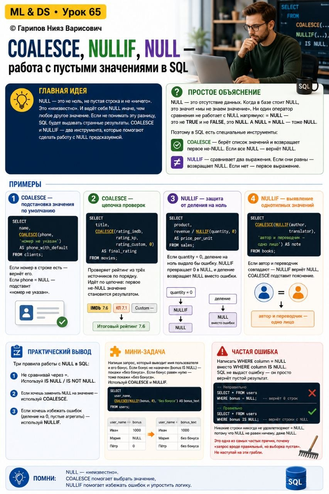

# ML & DS • Урок 65. COALESCE, NULLIF, NULL, работа с пустыми значениями в SQL

**Номер:** 65

ML & DS • Урок 65
COALESCE, NULLIF, NULL — работа с пустыми значениями в SQL

Главная идея
NULL — это не ноль, не пустая строка и не «ничего». Это «неизвестно». И ведёт себя NULL иначе, чем любое другое значение. Если не понимать эту разницу, SQL будет выдавать странные результаты. COALESCE и NULLIF — два инструмента, которые помогают сделать работу с NULL предсказуемой.

Простое объяснение

NULL — это отсутствие данных. Когда в базе стоит NULL, это значит «мы не знаем значение». Ни один оператор сравнения не работает с NULL напрямую: = NULL — это не TRUE и не FALSE, это NULL. А NULL = NULL — тоже NULL.

Поэтому в SQL есть специальные инструменты:

COALESCE — берёт список значений и возвращает первое не-NULL. Если все NULL — вернёт NULL.

NULLIF — сравнивает два выражения. Если они равны — возвращает NULL. Если нет — первое выражение.

Примеры

1. COALESCE — подстановка значения по умолчанию

SELECT
    name,
    COALESCE(phone, 'номер не указан') AS phone_with_default
FROM clients;
Если номер в строке есть — вернёт его. Если phone = NULL — подставит «номер не указан».

2. COALESCE — цепочка проверок

SELECT
    title,
    COALESCE(rating_imdb, rating_kp, rating_custom, 0) AS final_rating
FROM movies;
Проверяет рейтинг из трёх источников по порядку. Идёт по цепочке: первое не-NULL значение становится результатом.

3. NULLIF — защита от деления на ноль

SELECT
    product,
    revenue / NULLIF(quantity, 0) AS price_per_unit
FROM sales;
Если quantity = 0, деление на ноль выдало бы ошибку. NULLIF превращает 0 в NULL, и деление возвращает NULL вместо ошибки.

4. NULLIF — выявление однотипных значений

SELECT
    COALESCE(NULLIF(author, translator), 'автор и переводчик — одно лицо') AS note
FROM books;
Если автор и переводчик совпадают — NULLIF вернёт NULL, COALESCE подставит пояснение.

Практический вывод

Три правила работы с NULL в SQL:

1. Не сравнивай через =. Используй IS NULL / IS NOT NULL.
2. Если хочешь заменить NULL на значение — используй COALESCE.
3. Если хочешь избежать ошибок (деление на 0, пустые агрегаты) — используй NULLIF.

Мини-задача

Напиши запрос, который выводит имя пользователя и его бонус. Если бонус не назначен (bonus IS NULL) — покажи «без бонуса». Если бонус равен нулю — тоже покажи «без бонуса». Используй COALESCE и NULLIF.

Частая ошибка

Написать WHERE column = NULL вместо WHERE column IS NULL. SQL не выдаст ошибку — он просто вернёт пустой результат. Никакие строки никогда не удовлетворяют = NULL, потому что NULL не равен ничему, даже NULL.

Это одна из самых частых причин, почему «запрос вроде правильный, но выборка пустая». Не наступай на эти грабли.
