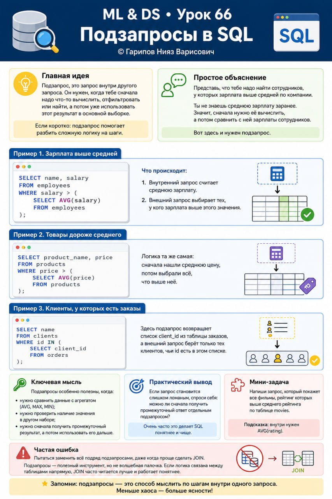

# ML & DS • Урок 66. Подзапросы в SQL

**Номер:** 66

ML & DS • Урок 66
Подзапросы в SQL

Главная идея
Подзапрос, это запрос внутри другого запроса. Он нужен, когда тебе сначала надо что-то вычислить, отфильтровать или найти, а потом уже использовать этот результат в основной выборке.

Если коротко:
подзапрос помогает разбить сложную логику на шаги.

Простое объяснение
Представь, что тебе надо найти сотрудников, у которых зарплата выше средней по компании.

Ты не знаешь среднюю зарплату заранее. Значит, сначала нужно её вычислить, а потом сравнить с ней зарплаты сотрудников.

Вот здесь и нужен подзапрос.

Пример 1. Зарплата выше средней

SELECT name, salary
FROM employees
WHERE salary > (
    SELECT AVG(salary)
    FROM employees
);

Что происходит:

1. Внутренний запрос считает среднюю зарплату.
2. Внешний запрос выбирает тех, у кого зарплата выше этого значения.

Пример 2. Товары дороже среднего

SELECT product_name, price
FROM products
WHERE price > (
    SELECT AVG(price)
    FROM products
);

Логика та же самая: сначала нашли среднюю цену, потом выбрали всё, что выше неё.

Пример 3. Клиенты, у которых есть заказы

SELECT name
FROM clients
WHERE id IN (
    SELECT client_id
    FROM orders
);

Здесь подзапрос возвращает список client_id из таблицы заказов, а внешний запрос берёт только тех клиентов, чьи id есть в этом списке.

Ключевая мысль
Подзапросы особенно полезны, когда:

• нужно сравнить данные с агрегатом (AVG, MAX, MIN);
• нужно проверить наличие значения в другом наборе;
• нужно сначала получить промежуточный результат, а потом использовать его дальше.

Практический вывод
Если запрос становится слишком ломаным, спроси себя:
можно ли сначала получить промежуточный ответ отдельным подзапросом?

Очень часто это делает SQL понятнее и чище.

Мини-задача
Напиши запрос, который покажет все фильмы, рейтинг которых выше среднего рейтинга по таблице movies.

Подсказка: внутри нужен AVG(rating).

Частая ошибка
Пытаться заменить всё подряд подзапросами, даже когда проще сделать JOIN.

Подзапросы — полезный инструмент, но не волшебная палочка. Если логика связана между таблицами напрямую, JOIN часто читается лучше и работает понятнее.
