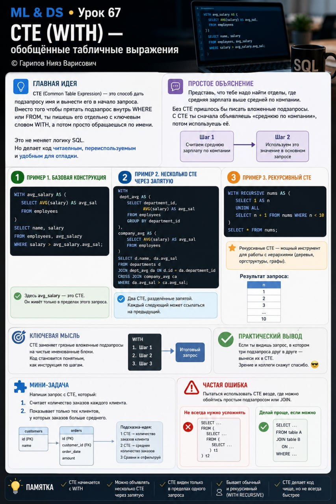

# ML & DS • Урок 67. CTE (WITH), обобщённые табличные выражения

**Номер:** 67

ML & DS • Урок 67
CTE (WITH) — обобщённые табличные выражения

Главная идея
CTE (Common Table Expression) — это способ дать подзапросу имя и вынести его в начало запроса. Вместо того чтобы прятать подзапрос внутрь WHERE или FROM, ты пишешь его отдельно с ключевым словом WITH, а потом просто обращаешься по имени.

Это не меняет логику SQL. Но делает код читаемым, переиспользуемым и удобным для отладки.

Простое объяснение
Представь, что тебе надо найти отделы, где средняя зарплата выше средней по компании.

Без CTE пришлось бы писать вложенные подзапросы. С CTE ты сначала объявляешь «среднюю по компании», потом используешь её.

Пример 1. Базовая конструкция

WITH avg_salary AS (
    SELECT AVG(salary) AS avg_sal
    FROM employees
)
SELECT name, salary
FROM employees, avg_salary
WHERE salary > avg_salary.avg_sal;

Здесь avg_salary — это CTE. Он живёт только в пределах этого запроса.

Пример 2. Несколько CTE через запятую

WITH
dept_avg AS (
    SELECT department_id, AVG(salary) AS avg_sal
    FROM employees
    GROUP BY department_id
),
company_avg AS (
    SELECT AVG(salary) AS avg_sal FROM employees
)
SELECT d.name, da.avg_sal
FROM departments d
JOIN dept_avg da ON d.id = da.department_id
CROSS JOIN company_avg ca
WHERE da.avg_sal > ca.avg_sal;

Два CTE, разделённые запятой. Каждый следующий может ссылаться на предыдущий.

Пример 3. Рекурсивный CTE

WITH RECURSIVE nums AS (
    SELECT 1 AS n
    UNION ALL
    SELECT n + 1 FROM nums WHERE n < 10
)
SELECT * FROM nums;

Рекурсивные CTE — мощный инструмент для работы с иерархиями (деревья, оргструктуры, графы).

Ключевая мысль
CTE заменяет грязные вложенные подзапросы на чистые именованные блоки. Код становится понятным, как инструкция по шагам.

Практический вывод
Если ты видишь запрос, в котором три подзапроса друг в друге — вынеси их в CTE. Зрение и коллеги скажут спасибо.

Мини-задача
Напиши запрос с CTE, который:

1. Считает количество заказов каждого клиента.
2. Показывает только тех клиентов, у которых заказов больше среднего.

Частая ошибка
Пытаться использовать CTE везде, где можно обойтись простым подзапросом или JOIN. CTE не быстрее — он чище. Если запрос простой, не усложняй.
