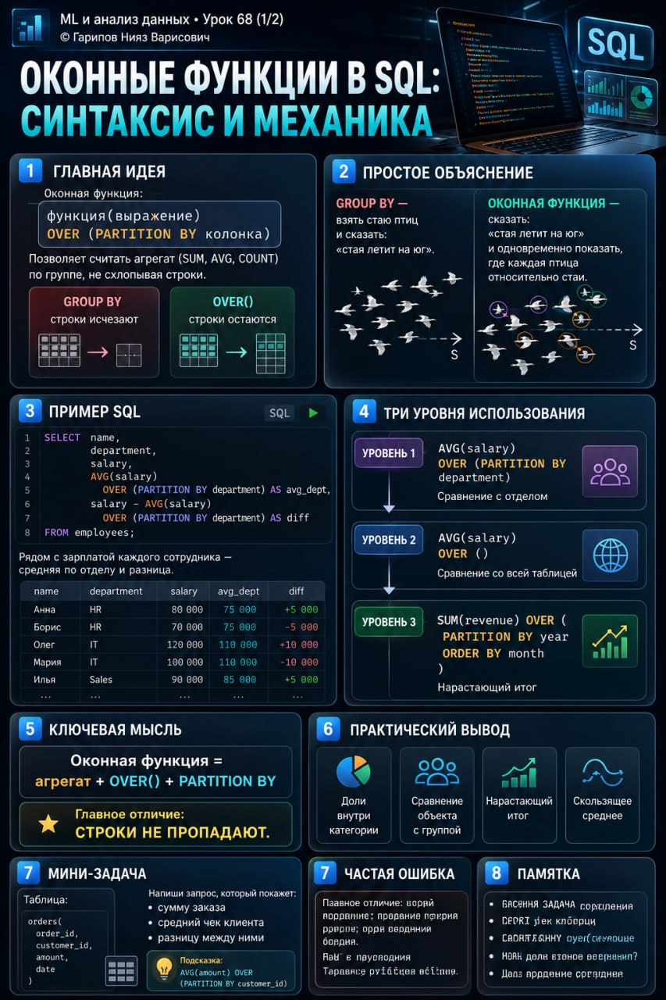

# ML и анализ данных • Урок 68 (1/2). Оконные функции в SQL, синтаксис и механика

**Номер:** 68/1

📊 ML и анализ данных • Урок 68 (1/2)

Оконные функции в SQL: синтаксис и механика

Был у тебя такой момент: нужно к каждой строке добавить среднее по группе — и ты лепишь подзапрос, джойнишь таблицу саму на себя?

Оконные функции решают это в одну строчку.

Вот как выглядит оконная функция:

функция(выражение) OVER (определение окна)

Три части:
— Функция: что считаем — SUM, AVG, COUNT, MIN, MAX
— Выражение: по какой колонке — salary, revenue
— Окно: границы расчёта — OVER (PARTITION BY department) или OVER ()

—

Смотрим на примере.

Таблица сотрудников:

SELECT name, department, salary FROM employees;

name     | department   | salary
Иванов   | Бухгалтерия  | 70 000
Петров   | Бухгалтерия  | 90 000
Сидоров  | IT           | 120 000
Кузнецов | IT           | 100 000
Смирнова | HR           | 60 000

Добавляем оконную функцию:

SELECT name, department, salary,
       AVG(salary) OVER (PARTITION BY department) AS avg_dept
FROM employees;

name     | department   | salary | avg_dept
Иванов   | Бухгалтерия  | 70 000 | 80 000
Петров   | Бухгалтерия  | 90 000 | 80 000
Сидоров  | IT           | 120 000| 110 000
Кузнецов | IT           | 100 000| 110 000
Смирнова | HR           | 60 000 | 60 000

Что произошло:
— Строки остались — ничего не схлопнулось
— Появилась новая колонка — средняя зарплата по отделу
— PARTITION BY department — это окно
— Бухгалтерия: (70 000 + 90 000) / 2 = 80 000 к Иванову и Петрову
— IT: (120 000 + 100 000) / 2 = 110 000 к Сидорову и Кузнецову

—

Расширенный синтаксис:

функция OVER (
  [PARTITION BY колонка_1, колонка_2 ...]
  [ORDER BY колонка [ASC | DESC]]
  [ROWS | RANGE BETWEEN ... AND ...]
)

PARTITION BY — на какие группы делим. Можно по нескольким колонкам. Как GROUP BY, но без схлопывания.

ORDER BY — порядок строк внутри окна. Нужен для нарастающих итогов и рангов. Без ORDER BY — итог по всей группе сразу.

ROWS / RANGE — какие строки включать в расчёт. По умолчанию — все строки группы.

—

Три уровня использования:

Уровень 1. Сравнить строку с группой:
AVG(salary) OVER (PARTITION BY department)

Уровень 2. Сравнить со всей таблицей:
AVG(salary) OVER ()

Комбинируем в одном запросе:
SELECT name, department, salary,
       AVG(salary) OVER (PARTITION BY department) AS avg_dept,
       AVG(salary) OVER () AS avg_company,
       salary - AVG(salary) OVER (PARTITION BY department) AS diff
FROM employees;

Уровень 3. Нарастающий итог:
SUM(revenue) OVER (PARTITION BY year ORDER BY month)
ORDER BY month — SUM считает нарастающим итогом: январь + февраль + март.

—

Ключевая мысль: оконная функция = агрегат + OVER() + PARTITION BY. Строки не пропадают — в этом отличие от GROUP BY. Если нужно сравнить строку с группой, не теряя строку — бери оконную.
