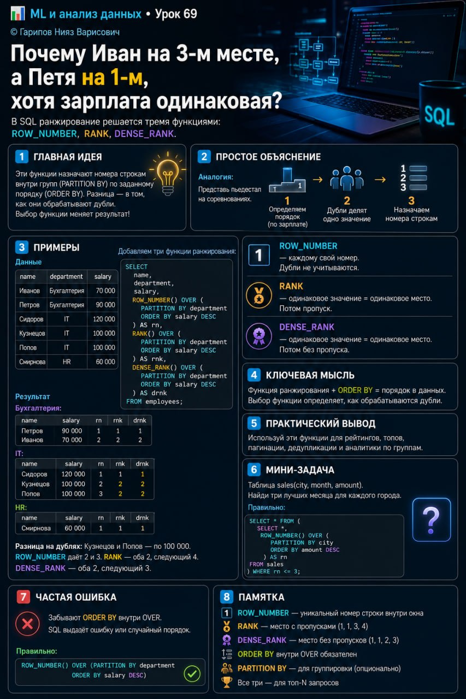

# ML и анализ данных • Урок 69

**Номер:** 69

📊 ML и анализ данных • Урок 69

Почему Иван на 3-м месте, а Петя на 1-м, хотя зарплата одинаковая?

Ты видел рейтинги, где люди делят одно место, а следующему достаётся уже третье? Или наоборот — первое, второе, третье, хотя дубли есть? SQL делает это тремя разными функциями. И выбор между ними меняет результат.

ROW_NUMBER, RANK, DENSE_RANK.

ROW_NUMBER — строгая нумерация. У каждого уникальный номер, дублям — разные.
RANK — олимпийская система. Два золота — следующему серебро, то есть третье место.
DENSE_RANK — компактная. Два золота — следующему бронза, то есть второе место.

Общий синтаксис:

    функция() OVER (
      PARTITION BY колонка
      ORDER BY колонка
    )

Главное отличие от SUM/AVG: ОБЯЗАТЕЛЕН ORDER BY. Без него ранжирование не имеет смысла.

—

Смотрим на таблице сотрудников:

    name     | department   | salary
    Иванов   | Бухгалтерия  | 70 000
    Петров   | Бухгалтерия  | 90 000
    Сидоров  | IT           | 120 000
    Кузнецов | IT           | 100 000
    Попов    | IT           | 100 000
    Смирнова | HR           | 60 000

Добавляем все три:

    SELECT
        name,
        department,
        salary,
        ROW_NUMBER() OVER (
            PARTITION BY department
            ORDER BY salary DESC
        ) AS rn,
        RANK() OVER (
            PARTITION BY department
            ORDER BY salary DESC
        ) AS rnk,
        DENSE_RANK() OVER (
            PARTITION BY department
            ORDER BY salary DESC
        ) AS drnk
    FROM employees;

Результат:

    Бухгалтерия:
    Петров   90 000 — rn=1  rnk=1  drnk=1
    Иванов   70 000 — rn=2  rnk=2  drnk=2

    IT:
    Сидоров  120 000 — rn=1  rnk=1  drnk=1
    Кузнецов 100 000 — rn=2  rnk=2  drnk=2
    Попов    100 000 — rn=3  rnk=2  drnk=2

    HR:
    Смирнова 60 000 — rn=1  rnk=1  drnk=1

Разница на дублях. Кузнецов и Попов — оба по 100 000. ROW_NUMBER даёт одному 2, другому 3. RANK — обоим 2, следующему 4. DENSE_RANK — обоим 2, следующему 3.

—

ROW_NUMBER — каждому свой номер. Дубли не учитываются.
RANK — одинаковое значение = одинаковое место. Потом пропуск.
DENSE_RANK — одинаковое значение = одинаковое место. Потом без пропуска.

—

Примеры применения:

ROW_NUMBER — «первые N в группе». Самый дорогой товар в категории:

    SELECT * FROM (
        SELECT
            product, category, price,
            ROW_NUMBER() OVER (
                PARTITION BY category
                ORDER BY price DESC
            ) AS rn
        FROM products
    ) WHERE rn = 1;

RANK — рейтинг продавцов:
RANK() OVER (ORDER BY revenue DESC)

DENSE_RANK — компактный топ-3:
DENSE_RANK() OVER (ORDER BY score DESC)

—

Где пригодится:
ROW_NUMBER — дедупликация, первые N записей, пагинация
RANK — рейтинги с дублями (олимпийская система)
DENSE_RANK — компактные топы (три первых места без провалов)

Мини-задача. Таблица sales(city, month, amount). Три лучших месяца для каждого города. Подсказка:

    ROW_NUMBER() OVER (
        PARTITION BY city
        ORDER BY amount DESC
    )

Частая ошибка. Забывают ORDER BY — SQL выдаёт ошибку или случайный порядок. ORDER BY обязателен.

Памятка:
— ROW_NUMBER — уникальный номер строки внутри окна
— RANK — место с пропусками (1, 1, 3, 4)
— DENSE_RANK — место без пропусков (1, 1, 2, 3)
— ORDER BY внутри OVER обязателен
— PARTITION BY — для группировки (опционально)
— Все три — для топ-N запросов
