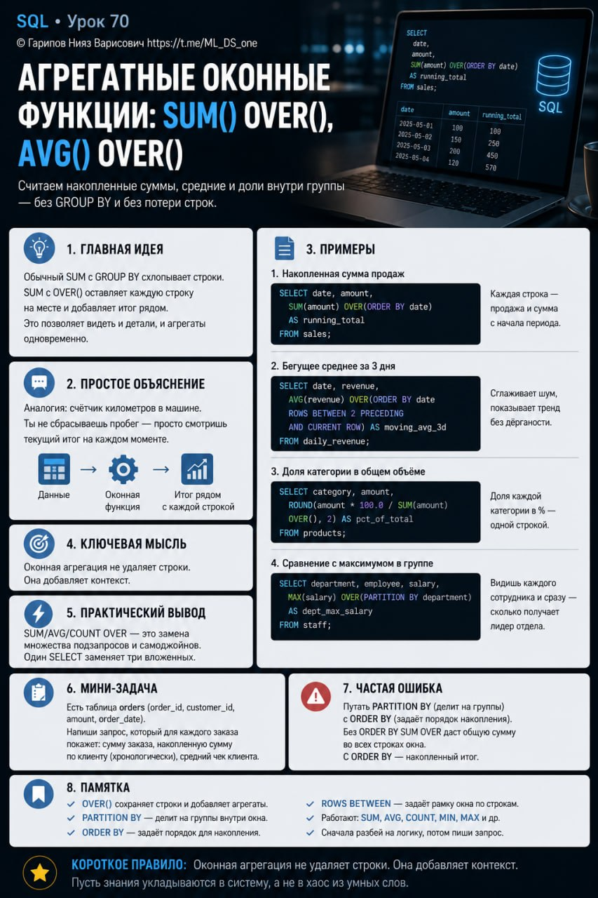

# Тема 70. Агрегатные оконные функции: SUM() OVER(), AVG() OVER()

**Номер:** 70

Тема 70. Агрегатные оконные функции: SUM() OVER(), AVG() OVER()

Ты уже умеешь нумеровать строки в окне. Теперь самое мощное: считать накопленные суммы, бегущие средние и доли внутри группы — без GROUP BY и без потери строк.

Главная мысль
Обычный SUM с GROUP BY схлопывает строки. SUM с OVER() оставляет каждую строку на месте и добавляет итог рядом. Это даёт возможность в одном запросе видеть и детали, и агрегаты одновременно.

Примеры

1. Накопленная сумма продаж

SELECT
  date,
  amount,
  SUM(amount) OVER(ORDER BY date) AS running_total
FROM sales;

Каждая строка показывает продажу + сколько продано с начала периода.

2. Бегущее среднее за 3 дня

SELECT
  date,
  revenue,
  AVG(revenue) OVER(ORDER BY date ROWS BETWEEN 2 PRECEDING AND CURRENT ROW) AS moving_avg_3d
FROM daily_revenue;

Сглаживает шум, показывает тренд без дёрганости по дням.

3. Доля категории в общем объёме

SELECT
  category,
  amount,
  ROUND(amount * 100.0 / SUM(amount) OVER(), 2) AS pct_of_total
FROM products;

Доля каждой категории в процентах — одной строкой, без подзапросов.

4. Сравнение с максимумом в группе

SELECT
  department,
  employee,
  salary,
  MAX(salary) OVER(PARTITION BY department) AS dept_max_salary
FROM staff;

Видишь каждого сотрудника и сразу — сколько получает лидер отдела.

Практический вывод
SUM/AVG/COUNT OVER — это замена множеству подзапросов и самоджойнов. С ними один SELECT заменяет три вложенных.

Мини-задание
Есть таблица orders (order_id, customer_id, amount, order_date). Напиши запрос, который для каждого заказа покажет: сумму заказа, накопленную сумму по клиенту (хронологически), средний чек клиента.

Частая ошибка
Путать PARTITION BY (делит на группы) с ORDER BY (задаёт порядок накопления). Без ORDER BY SUM OVER даст общую сумму во всех строках окна. С ORDER BY — накопленный итог.

Короткое правило
Оконная агрегация не удаляет строки. Она добавляет контекст.

Пусть знания укладываются в систему, а не в хаос из умных слов.
